# SOC Automation Project

<p align="center">
  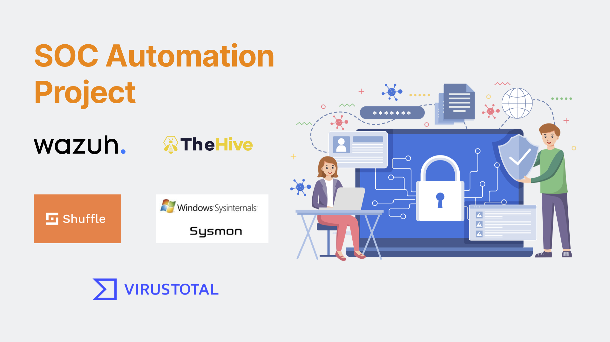
</p>

This project outlines the construction of a **Security Operations Center (SOC)** environment using industry-standard, free, and open-source tools. Participants will deploy a Windows virtual machine and configure it to forward critical security events to Wazuh, a security monitoring platform.  Furthermore, we'll integrate Shuffle, an automation framework, to enable automated incident response.  These automated responses will include enriching event data with threat intelligence from online sources, creating a documented record of the event within a case management system, and notifying security analysts via email. This comprehensive approach empowers analysts to effectively investigate and remediate security issues.

This project was inspired by the tutorial videos by [MyDFIR](https://www.youtube.com/@MyDFIR). His videos are a great resource for anyone looking to learn practical cybersecurity skills, particularly in digital forensics and incident response.

#### Skills Learned
- Practical experience in building and configuring an automated SOC environment.
- Proficiency in using open-source security tools like Wazuh, Sysmon, TheHive, Shuffle, and VirusTotal.
- Ability to create custom rules and workflows for detecting and responding to Mimikatz attacks.
- Understanding of incident response processes and the importance of SOC - automation.
- Enhanced knowledge of cybersecurity threats and the tools and techniques used to mitigate them.

#### Tools Used
- **Wazuh**: An open-source security information and event management (SIEM) platform.
- **Sysmon**: A Windows system monitoring tool that provides detailed information about system activity.
- **TheHive**: A security incident response platform for managing and investigating security events.
- **Shuffle**: A SOAR (Security Orchestration, Automation and Response) platform for automating security workflows.
- **VirusTotal**: A service that analyzes files and URLs to detect malware.

## 1. Setting up the Environment
### 1.1 Virtual Machine Setup
This project utilizes a hybrid environment with cloud-based VMs and a local machine. We'll use **DigitalOcean** to host our **Wazuh Manager** and TheHive server, while the **Windows 10 machine** acting as the **Wazuh Agent** will reside on your local network.

#### Creating the Wazuh Manager VM
To begin, we log in to DigitalOcean and create a new Droplet.  
- **Choose Region**: [choose the datacenter nearest, in my case is Toronto]
- **Choose an image**: Ubuntu 22.04 (LTS) x64
- **Choose Size**: 
    - Droplet Type: Basic
    - CPU options: Premium Intel  - 8 GB RAM, 160 GB NVMe SSDs, 5 TB transfer
- **Choose Authentication Method**: Password [create your password]
- **Hostname**: Wazuh

Next, we are going to setup firewall for our Wazuh manager machine. To do this, click on **Networking** in the Manage menu on the left hand side, then select **Firewalls** tab, **Create Firewall**. I name this firewall as Firewall. The inbound rules for this firewall is only allowing incoming traffic from our public IP. So, the configuration for this firewall would be as following:

<p align="center">
  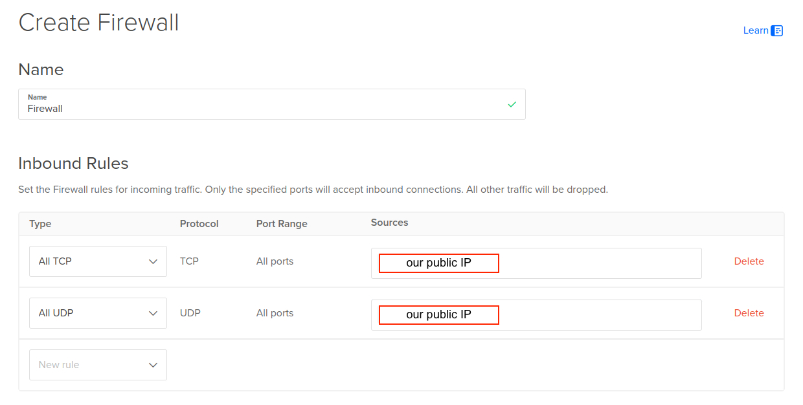
</p>

Then, we add our Wazuh Server machine to this Firewall by click on Add Droplets, type Wazuh at the input box, and click Add Droplet. For now, our Wazuh server has been protected by the firewall.

#### Creating the TheHive VM
Follow the same steps as above to create a new Droplet and name the hostname as Thehive. We also add the firewall we use with Wazuh Manager for this machine. After this process, we have two machines on cloud, one for Wazuh Manager and one for TheHive

<p align="center">
  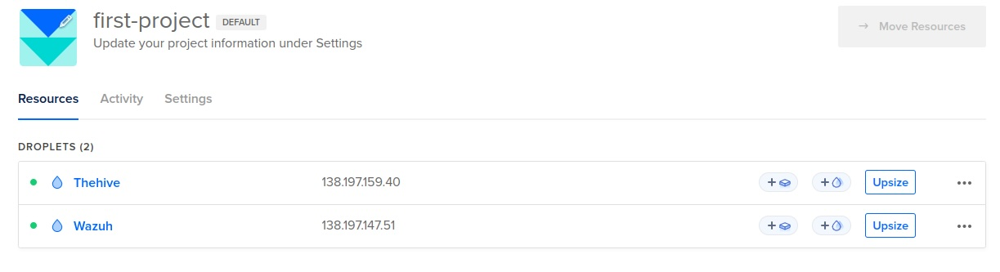
</p>

### 1.2 Installing and Configuring Wazuh
#### 1.2.1 Wazuh Manager
#### Installing Wazuh Manager
SSH into our Wazuh Manager VM:
```sh
ssh root@138.197.147.51
```
Then, update the system's package list and upgrade any existing packages to their latest versions:
```sh
apt-get update && apt-get upgrade -y
```
After finishing the update and upgrade process, we install the Wazuh manager package by running the following command:
```sh
curl -sO https://packages.wazuh.com/4.7/wazuh-install.sh && sudo bash ./wazuh-install.sh -a
```
During the installation, if we are prompted to configure the Wazuh dashboard. Follow the on-screen instructions and choose the default options. Once the installation is complete, make note of the username and password provided. We will need these credentials to access the Wazuh dashboard

<p align="center">
  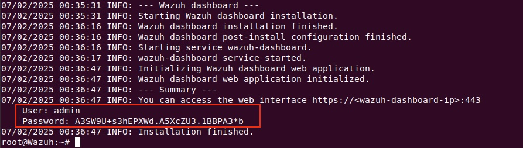
</p>

To access to the web interface, open the brower and go to the address:
`https://wazuh-server-public-IP-address`. If we see the alert "Your connection is not private", click on **Advance**,  then **Process** and put our *username* and *password* and go to the Wazuh dashboard.

<p align="center">
  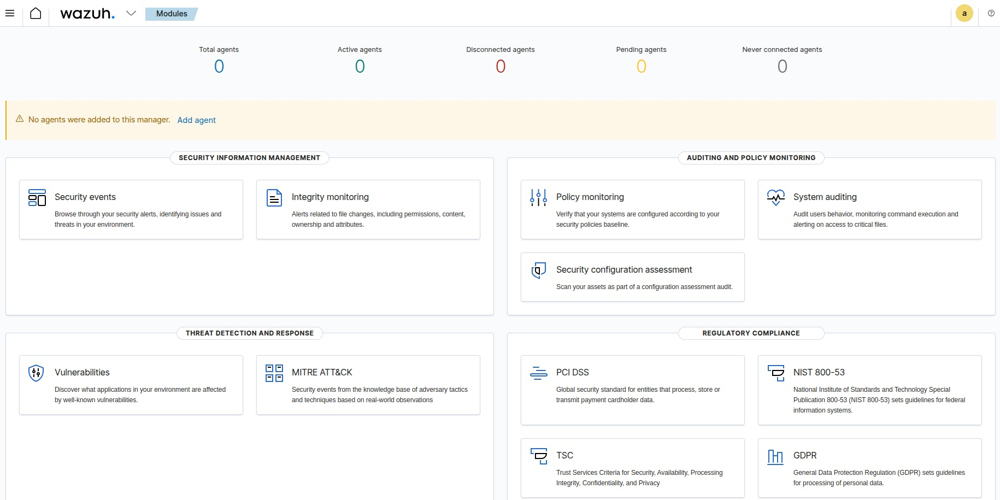
</p>

#### Configuring ossec.conf file
Wazuh by default does not log everything so we need to configure Wazuh to log Mimikatz by modify the Wazuh's configuration file, `ossec.conf`. on Linux, we can fint it at `/var/ossec/etc/ossec.conf`. Before making any change to this file, we should back up it. In the terminal, run the command:
```sh
cp /var/ossec/etc/ossec.conf ~/ossec-backup.conf
```
then, open `ossec.conf` file:   
```sh
nano /var/ossec/etc/ossec.conf

```
We locate the `<logall>` and `<logall_json>` tags within the `<ossec_config>` section. Then, change the value of both tags to **yes** to enable full logging. 

<p align="center">
  
</p>

We now save `ossec.conf` file and restart the Wazuh manager service to apply the changes: systemctl restart wazuh-manager.service
#### Configuring Filebeat
Wazuh uses **Filebeat** to forward log data to **Elasticsearch**, which is where the Wazuh dashboard retrieves the data for analysis and visualization. To ensure our Wazuh archives are correctly indexed and searchable, we need to configure Filebeat. At the Wazuh Manager terminal, navigate to archives directory and open `filebeat.yml` configuration file
```sh
cd var/ossec/logs/archives
nano /etc/filebeat/filebeat.yml
```
Locate the `filebeat.modules` section and find the module named `wazuh`. Within the `wazuh module`, ensure that both alerts and archives are enabled by setting `enabled: true` for each.

<p align="center">
  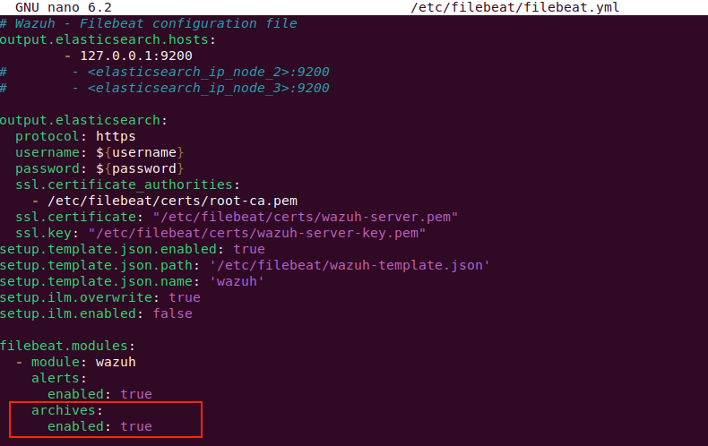
</p>

Save the `filebeat.yml` file and restart the Filebeat service to apply the changes:
```sh
systemctl restart filebeat.service
```
#### Creating a New Index for Wazuh Archives
Wazuh stores its data in different indexes within Elasticsearch. By default, it creates indexes for alerts, monitoring, and statistics. To effectively manage our archive data, we need to create a dedicated index for it.

Access the Wazuh dashboard and click on the hamburger icon in the top left corner to open the main menu. Select Stack Management and then Index Patterns. Here we see three indexes: `wazuh-alerts-*`, `wazuh-monitoring-*`, and `wazuh-statistic-*`. 

Click on the **Create index pattern** button on the top right corner. In the Index pattern name field, enter `wazuh-archives-*`. The asterisk acts as a wildcard, allowing the index to accommodate multiple archives. 
Choose timestamp as the time field. This ensures that your archive data is properly timestamped for analysis and reporting.

Now, when we return to the Wazuh dashboard and select the `wazuh-archives-*` index, we are able to search and analyze the archived data, including the Mimikatz events we'll be generating later.

#### 1.2.2 Wazuh Agent - Windows 10 VM
To add Windows 10 VM as our Wazuh agent, at Wazuh dashboard homepage, we click on the Add agent, the page Deploy new agent appear to show the steps to deploy a new agent. With `138.197.147.51` is my Wazuh server public IP and **martin** is the name of my Windows 10 machine, We put the options as following:

<p align="center">
  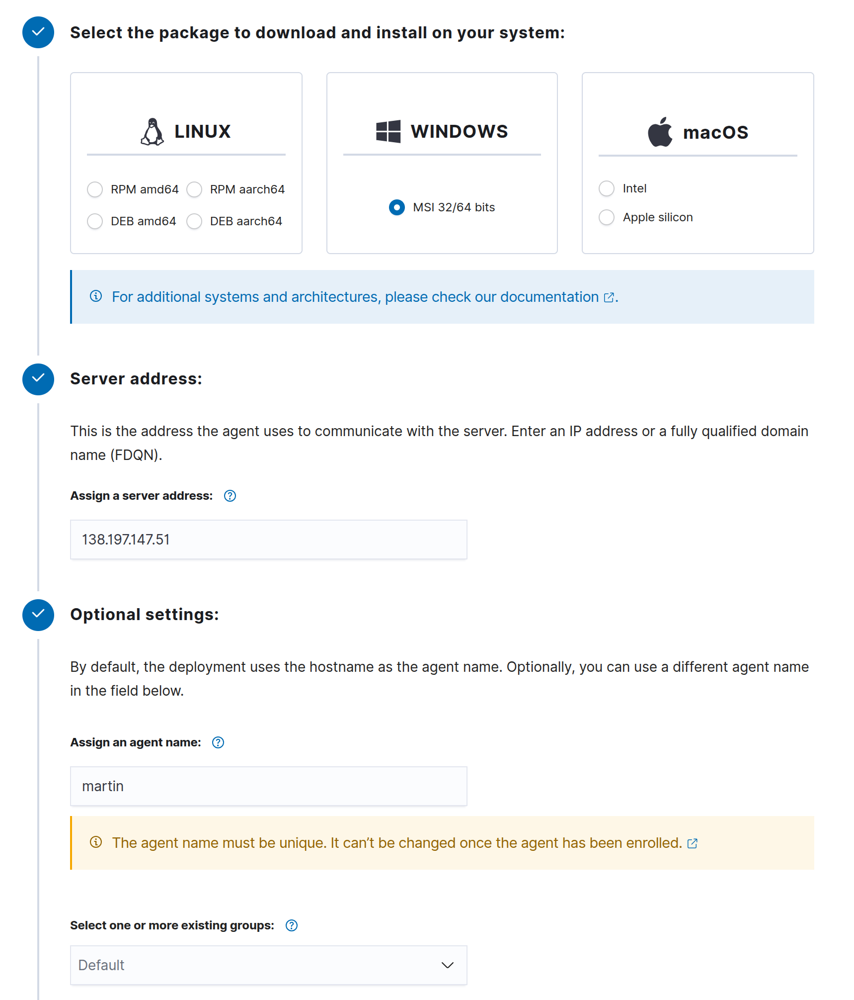
</p>

Then, we copy the command and open the PowerShelll as Administrator on Windows machine to run it.

<p align="center">
  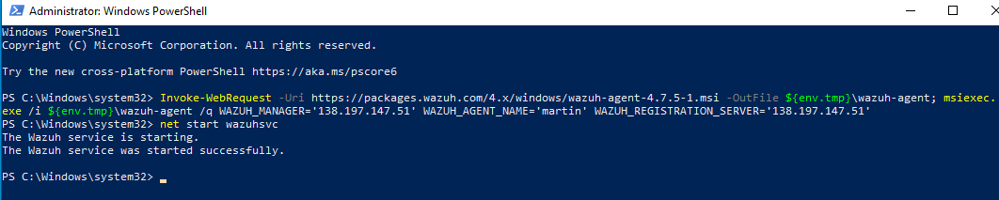
</p>

After the command is done installing we can then start the service by the command
```sh
net start wazuhsvc
```
Now we back to our Wazuh manager, close the **Deploy new agent** page and we can see now we have one agent and after a few second, refresh the page we can see the agent us active now.

<p align="center">
  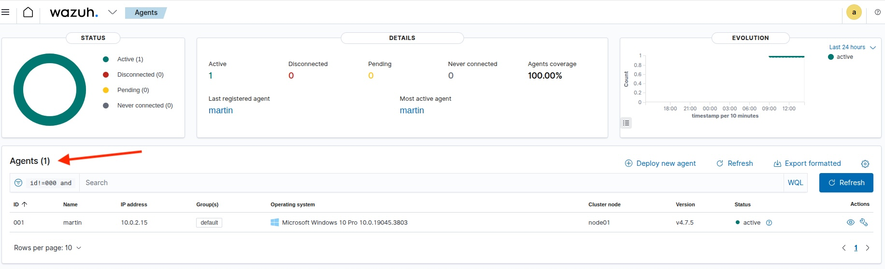
</p>

### 1.3 Installing and Configuring TheHive
TheHive is a scalable open-source incident response platform that will enable us to efficiently manage and investigate the alerts generated by our SOC. In this section, we'll install and configure TheHive on our dedicated Ubuntu VM.

#### 1.3.1 Installing TheHive
On our host, ssh into our TheHive VM
```sh
ssh root@138.197.159.40
```
Update the system's package list and upgrade existing packages:
```sh
apt-get update && apt-get upgrade -y
```
Then, Install the required dependencies:
```sh
apt install wget gnupg apt-transport-https git ca-certificates ca-certificates-java curl  software-properties-common python3-pip lsb-release
```
Add the necessary repositories and install Java, Cassandra, and Elasticsearch:
```sh
# Install Java
wget -qO- https://apt.corretto.aws/corretto.key | sudo gpg --dearmor  -o /usr/share/keyrings/corretto.gpg
echo "deb [signed-by=/usr/share/keyrings/corretto.gpg] https://apt.corretto.aws stable main" |  sudo tee -a /etc/apt/sources.list.d/corretto.sources.list
sudo apt update
sudo apt install java-common java-11-amazon-corretto-jdk
echo JAVA_HOME="/usr/lib/jvm/java-11-amazon-corretto" | sudo tee -a /etc/environment 
export JAVA_HOME="/usr/lib/jvm/java-11-amazon-corretto"

# Install Cassandra
wget -qO -  https://downloads.apache.org/cassandra/KEYS | sudo gpg --dearmor  -o /usr/share/keyrings/cassandra-archive.gpg
echo "deb [signed-by=/usr/share/keyrings/cassandra-archive.gpg] https://debian.cassandra.apache.org 40x main" |  sudo tee -a /etc/apt/sources.list.d/cassandra.sources.list
sudo apt update
sudo apt install cassandra

# install ElasticSearch
wget -qO - https://artifacts.elastic.co/GPG-KEY-elasticsearch |  sudo gpg --dearmor -o /usr/share/keyrings/elasticsearch-keyring.gpg
sudo apt-get install apt-transport-https
echo "deb [signed-by=/usr/share/keyrings/elasticsearch-keyring.gpg] https://artifacts.elastic.co/packages/7.x/apt stable main" |  sudo tee /etc/apt/sources.list.d/elastic-7.x.list
sudo apt update
sudo apt install elasticsearch
Finally, install TheHive itself:
wget -O- https://archives.strangebee.com/keys/strangebee.gpg | sudo gpg --dearmor -o /usr/share/keyrings/strangebee-archive-keyring.gpg
echo 'deb [signed-by=/usr/share/keyrings/strangebee-archive-keyring.gpg] https://deb.strangebee.com thehive-5.2 main' | sudo tee -a /etc/apt/sources.list.d/strangebee.list
sudo apt-get update
sudo apt-get install -y thehive
```

#### 1.3.2 Configuring TheHive
TheHive requires some configuration to connect to its backend components (Cassandra and Elasticsearch).
#### Cassandra
We first configure Cassandra by editing the **cassandra.yaml** file
```sh
nano /etc/cassandra/cassandra.yaml
```
In this file, we modify the following settings: `cluster name` , `lisen address`, `rpc address` and `seeds`:
- **cluster_name**: martin
- **listen_address**: 138.197.159.40
- **rpc_address**: 138.197.159.40
- **seeds**: 138.197.159.40:7000

where `138.197.159.40` is my TheHive machine public IP.

Then, we stop Cassandra service and remove old files with the commands:
```sh
systemctl stop cassandra.service
rm -rf /var/lib/cassandra/*
```
and restart Cassandra service 
```sh
systemctl start cassandra.service
```
To make sure Cassandra is running, we can check it status:
```sh
systemctl status cassandra.service
```
<p align="center">
  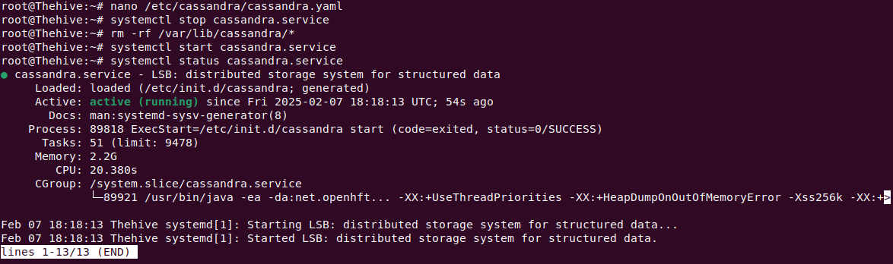
</p>

#### ElasticSearch
Configure Elasticsearch by editing the **elasticsearch.yml** file:
```sh
nano /etc/elasticsearch/elasticsearch.yml
```
In this file, we change the `cluster.name` to **Thehive**

`cluster.name: thehive`
and uncomment node.name

`node.name: node-1`

We also uncomment **network.host** and change the value into public IP of our TheHive machine

`network.host: 138.197.159.40`

Next, we uncomment **http.port**

`http.port: 9200`

We also uncomment `cluster.initial_master_nodes` and remove `node-2` as we do not have a second node

`cluster.initial_master_nodes:L ["node-1"]`

After these changes, we start the service
```sh
systemctl start elasticsearch.service
```
then, enable it:
```sh
systemctl enable elasticsearch.service
```
and check it status: 
```sh
systemctl status elasticsearch.service
```
<p align="center">
  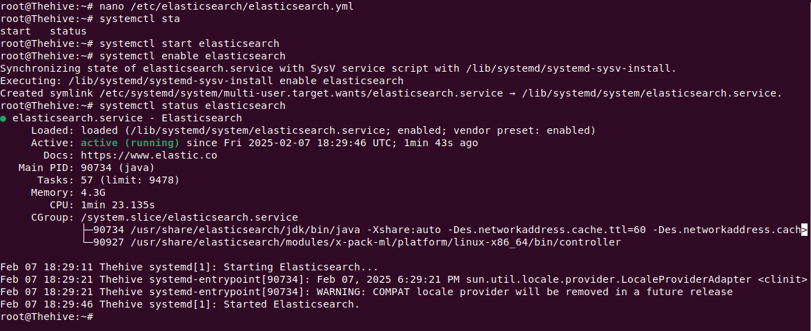
</p>

#### TheHive
Next, we are going to configure TheHive. Before doing that, we need to make sure that TheHive users and group have access permission to a certain file path. Therefore, in TheHive terminal, run the command:
```sh
ls -la /opt/thp
```
We can see root has access to TheHive directory, we need to change that, so, we run the command:
```sh
chown -R thehive:thehive /opt/thp
```
and now re check the access permission by:
```sh
ls -la /opt/thp
```
and we can see TheHive users and TheHive group have the permission here:

<p align="center">
  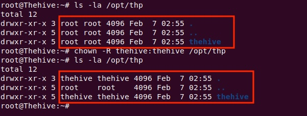
</p>

To start configuring TheHive, we need to modify the file **application.conf**. Let us open it:
```sh
nano /etc/thehive/application.conf
```
We looking for `db.janusgraph` section, `index.search` section and `application.baseUrl`, then change `hostname` of those sections to public IP of TheHive, in my case is `138.197.159.40`

After saving this file, we start and then enable TheHive service
```sh
systemctl start thehive.service
systemctl enable thehive.service
```
and also check the status of the service
```sh
systemctl status thehive.service
```
Now we can access to TheHive by the navigating to the public IP of TheHive with port **9000** and use the default credential which is **'admin@thehive.local'** with a password of **'secret'**

<p align="center">
  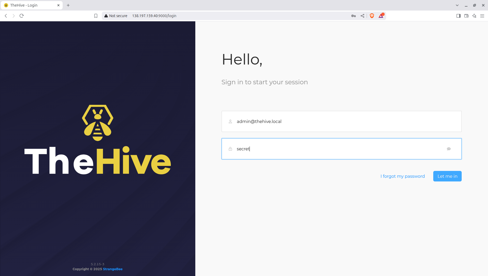
</p>

The important note here is if we can not login with default credential while Cassandra, Eleasticsearch, and TheHive are still running, we can handle the problem by creating a custom JVM option file under `/etc/elasticsearch/jvm.options.d`. The details is as folllowing, first, we create file jvm.options:
```sh
nano /etc/elasticsearch/jvm.options.d/jvm.options
```
and then we put the following configurations in that file.
```sh
-Dlog4j2.formatMsgNoLookups=true
-Xms2g
-Xmx2g
```
Finally, restart the Elasticsearch and try to login TheHive again.

### 1.5 Setting up Shuffle 
**Shuffle** is our Security Orchestration, Automation and Response (SOAR) platform. It will enable us to automate the analysis and response actions when Mimikatz is detected.

#### 1.5.1 Creating a Shuffle Workflow
Go to **shuffle.io** and login, then select workflow on the left hand sid, then create new workflow with name is `SOC Automation Project` and usecases is `EDR to ticket`. Once a workflow is created, we will be presented with the following view:

<p align="center">
  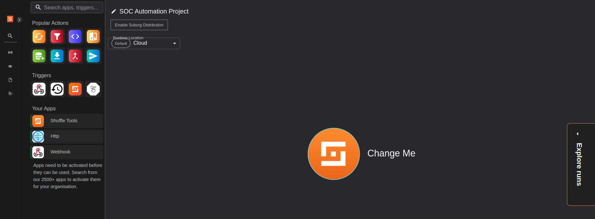
</p>

#### 1.5.2 Configuring Webhooks and Actions
Drag and drop **Webhook** node into the main window and name it as **Wazuh-alerts** and choose `Associated App`. We also connect this Webhook with the Change Me node.

<p align="center">
  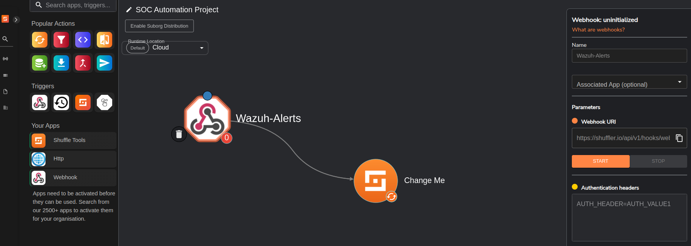
</p>

Then, click on Change Me node, choose **Repeat back to me** at **Find Actions** drop down list and choose **Execution Argument** at **Call box**

<p align="center">
  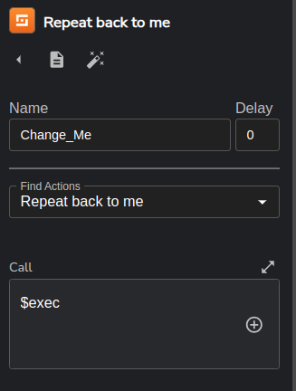
</p>

We save workflow by click on the save icon at the end of main window.

<p align="center">
  
</p>

Now, we need to let Wazuh manager know that we are integrating with Shuffle. To do that, we open file `ossec.conf` file at Wazuh manager CLI and add the following configuration in between the `<ossec_config>` tag:
```xml
<integration>
    <name>shuffle</name>
    <hook_url>https://shuffler.io/api/v1/hooks/webhook_26fb8816-f32e-4a0f-9d40-c183ca028a50 </hook_url>
    <rule_id>100002</rule_id >
    <alert_format>json</alert_format>
</integration>
```
where `https://shuffler.io/api/v1/hooks/webhook_26fb8816-f32e-4a0f-9d40-c183ca028a50` is my Webhook URI

Then we restart wazuh-manager service and back to the shuffle.io to start the Webhook. With this configuration, Wazuh will now send alerts to Shuffle whenever it detects suspicious activity. In the next section, we'll generate some Mimikatz events to test our setup.

## 2. Generating Telemetry and Detecting Mimikatz
### 2.1 Generating Mimikatz Events 

#### Configure occess.conf file
When we install Wazuh, the main configuration file is `occess.conf`. On Windows agent, this file is located at `Program Files (x86)\ossec-agent\occess.conf`. It is recommended to back up this file before making changes to it. A configuration error may prevent Wazuh services from starting up. 

After backing up `occess.conf`, open it by Notepad with Administrator permission. Then we scroll down and looking for `<!--log analysis-->` tag and modify the first `<localfile>` tag become:
```xml
<localfile>
    <location> Microsoft-Windows-Sysmon/Operational</location>
    <log_format>eventchannel</log_format>
</localfile>
```
We also remove the `<localfile>` tag with the `<location>` tag value is **Security**. Then we save the file and restart Wazuh by go to services, right click Wazuh and restart. To check if our configuration is correct, go to Wazuh dashboard, under events, make sure we in alerts index and we can search for `sysmon`.

<p align="center">
  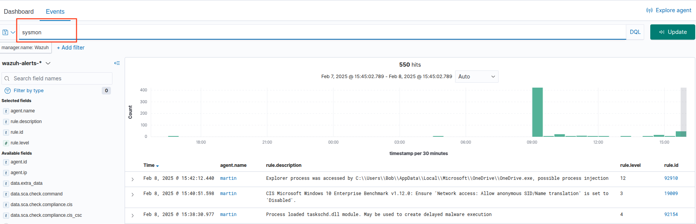
</p>

#### Download and execute Mimikatz
Before downloading Mimikatz, we need to exclude the download path. To do that, open Windows Security, click on **dismiss** under **Virus & threat protection**, then double click on **Virus & threat protection**, seclect **Add or remove exclusions**, then Add an exclusion and choose Folder, then select **Download** folder.

<p align="center">
  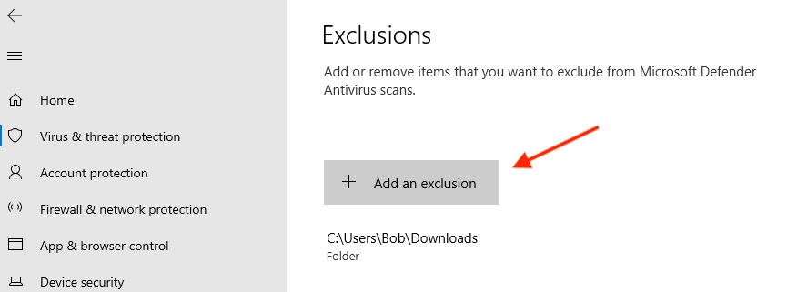
</p>

We also need to turn off the protection in our browser.
- For **Microsoft Edge**: open browser settings, navigate to **Privacy, search, and services**, and then under **Services**, toggle the **Microsoft Defender SmartScreen** option to off.
- For **Google Chrome**: go to **Setting**, then **Privacy and security**, **Security**, select **No protection**

To download Mimikatz, we go to [Mimikatz repository](https://github.com/gentilkiwi/mimikatz/releases), and download file `mimikatz_trunk.zip`

<p align="center">
  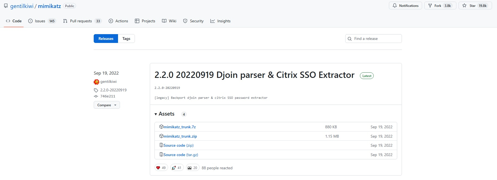
</p>

Next, on Windows 10 machine, go to folder **Downloads**, **extract all** file `mimikatz_trunk.zip`. Then, we open **Power Shell** as Administrator, change directory to mimikatz folder and execute `mimikatz.exe`.

<p align="center">
  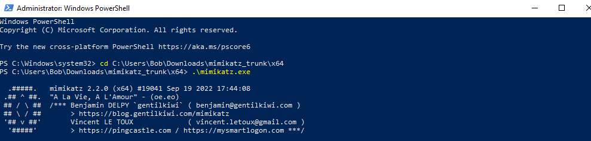
</p>

To make sure **Sysmon** is capturing Mimikatz, we open **Event Viewer** and navigate to **Applications and Services Logs/Microsoft/Windows/Sysmon/Operational**. We Look for `Event ID 1`, which indicates process creation.

<p align="center">
  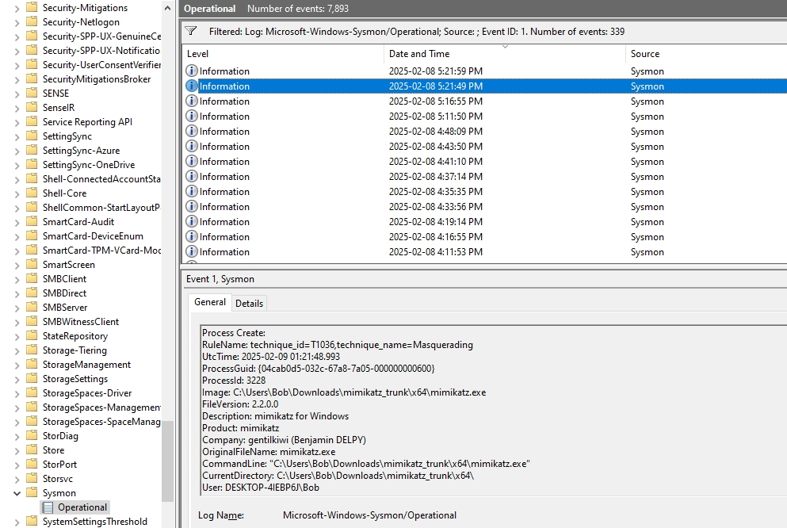
</p>

At this time, we can head back to **Wazuh Manager** dashboard and search for `mimikatz` under `wazuh-archives-*` index. We can see we got two events, one with the event **ID 1** and the other one has event **ID 7**.

<p align="center">
  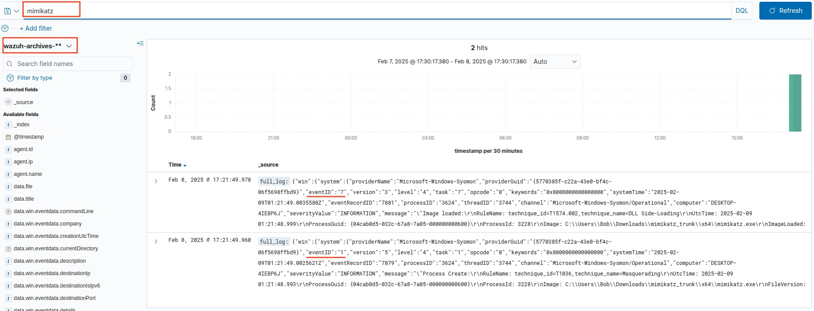
</p>

Next we expand the event witht the event **ID 1** and take a look at the fields. We have a field called `OriginalFileName`. We will use this field to craft our alerts because if we use other fields such as `image`, the attacker can be simply rename mimikatz to anything else to bypass the alert

<p align="center">
  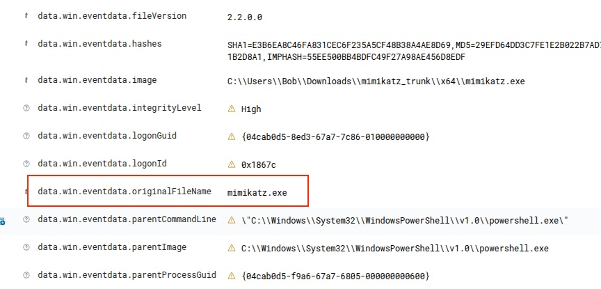
</p>

#### 2.2 Creating a Custom Alert Rule 
At dashboard home page, click to the dropdown menu next to the Wazuh icon, select **Management**, **Rules**, **manage rules files**. Because we are interested specifically in the event ID 1 for sysmon, we are going find for it, put `sysmon` in the search bar and we see file `0800-sysmon_id_1.xml`, click the icon view to view the content of this file. 

We copy a rule to use to custom. We back to the rules file page and click on **Custom rules** button on the right hand side. We see `local_rules.xml` file here. Click on the pencil icon to edit it. Paste the rule we copy to this local rules file and custom it as following:
```xml
<rule id="100002" level="15">
    <if_group>sysmon_event1</if_group>
    <field name="win.eventdata.originalFileName" type="pcre2">(?i)mimikatz\.exe</field>
    <description>Mimikatz Usage Detected</description>
    <mitre>
      <id>T1003</id>
    </mitre>
  </rule>
```
Once we've saved the `local_rules.xml` file, confirm the restart of the Wazuh manager to apply the new rule. To test this, try renaming the Mimikatz executable to something less conspicuous, for example, I rename `mimikatz.exe` to `goodjob.exe`. Then, we execute this renamed file and observe the Wazuh dashboard. 

Despite the name change, Wazuh will still generate an alert, demonstrating its ability to identify Mimikatz based on its original file name, even if an attacker attempts to disguise it.

<p align="center">
  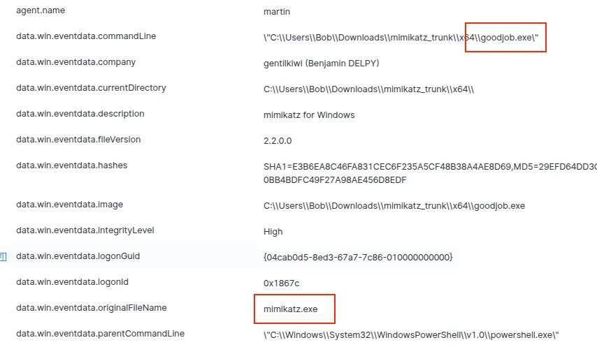
</p>

## 3. Automating Response Actions
### 3.1 Integrating with VirusTotal
To further enrich our analysis of detected Mimikatz events, we'll integrate VirusTotal into our Shuffle workflow. VirusTotal analyzes files and URLs to detect malware and provides valuable information about their reputation.  
#### 3.1.1 Extract Hashes from Wazuh Events
In our Shuffle workflow, click on the **Change Me** node that follows the **Wazuh Alerts** webhook and put configuration as followings:
- **Name**: SHA256-Regex
- **Find Actions**: Regex capture group
- **Input data**: `$exec.text.win.eventdata.hashes`. we choose this value by click on the plus icon, Execution Argument then looking for hashes
- **Regex**: SHA256=([a-fA-F0-9]{64}). This regular expression will specifically capture the SHA256 hash.
 
#### 3.1.2 Add VirusTotal Node
Drag and drop the **VirusTotal v3** app node into your workflow. Then, connect it after the **SHA256-Regex** node. Configure the VirusTotal node with the following options:
- **Name**: VirusTotal
- **Find Actions**: Get a file report
- **Id**: `$extract_hashes.group_0#` (Don't forget the # at the end)

#### 3.1.3 VirusTotal Authentication
Navigate to VirusTotal website, login and get the **API key**

<p align="center">
  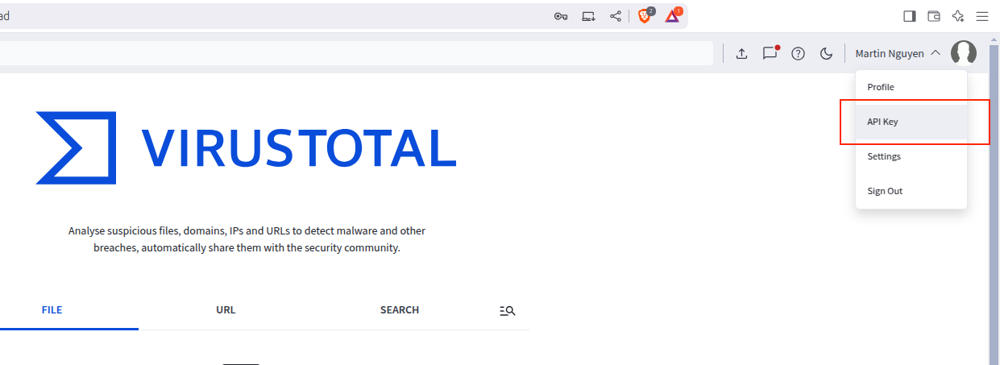
</p>

In our Shuffle workflow, click on **Authentication for the VirusTotal** node, paste our API key and submit. Now, whenever an alert is triggered, Shuffle will extract the SHA256 hash of the detected file and send it to VirusTotal for analysis. The results from VirusTotal will be included in the workflow data, providing valuable context for incident response. We specially focus on the attribute call last_analysis_stats which give us the important information about the hash.

<p align="center">
  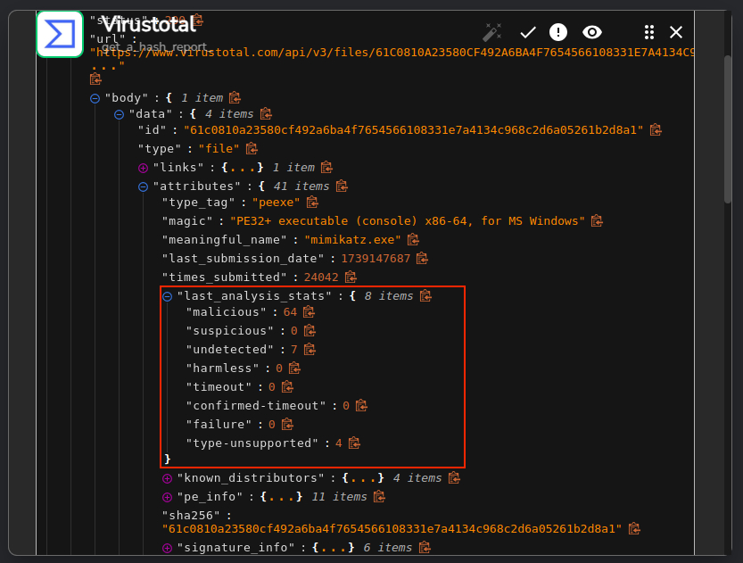
</p>

### 3.2 Sending Alerts to TheHive
To centralize our incident response and allow for collaborative investigation, we'll configure our Shuffle workflow to automatically create alerts in TheHive.

#### 3.2.1 Prepare TheHive
Log in to TheHive using the default credentials: **admin@thehive.local:secret**. Then, create a new organization.
Within the organization, create two users. I my case, I create:
- **martin** | martin@test.com | Type: Normal | Profile: Analyst , for manual interaction with TheHive.
- **SOAR** | shuffle@test.com | Type: Service | Profile: Analyst, for Shuffle integration.

<p align="center">
  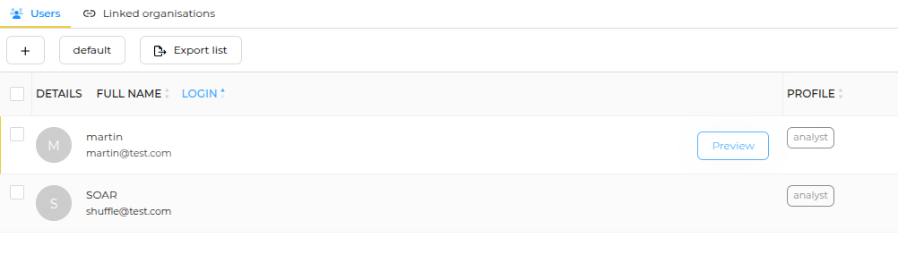
</p>

Then, we create password for user martin and put the API key for user SOAR, when we see the API key, we should save it because we will use it to authenticate with Shuffle

#### 3.2.2 Add TheHive Node to Shuffle
In our Shuffle workflow, drag and drop the **TheHive app** node into the workspace and connect it after the VirusTotal node. Configure the TheHive node with the following:
- **Name**: TheHive_1
- **Find Actions**: Create alert
Then, click on **Authentication for TheHive** and put the parameters which the apikey we got from user SOAR at previous step and The url is TheHive public IP address go along with port 9000. 

<p align="center">
  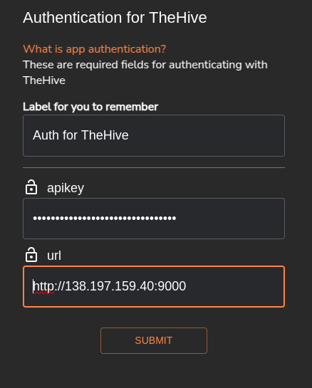
</p>

We also put some parameter for TheHive

<p align="center">
  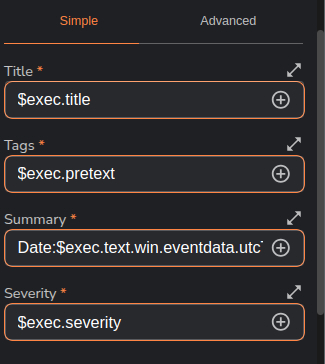
</p>

We need to allow TCP traffic inbound on port 9000. Therefore, go to the Firewall configution in DigitalOcean and add the **Inbound Rule** as following:

<p align="center">
  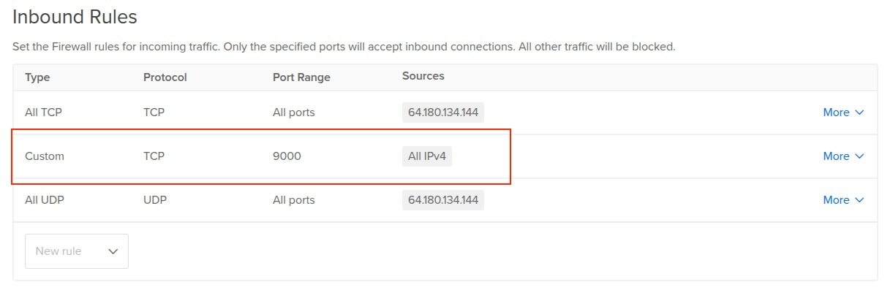
</p>

With this configuration, whenever an alert is triggered in Wazuh and processed through Shuffle, a corresponding alert will be automatically created in TheHive. This allows analysts to efficiently manage, track, and investigate potential security incidents in a centralized platform.

### 3.3 Email Notifications
To ensure timely awareness of potential security incidents, we'll configure email notifications in our Shuffle workflow. This will alert the SOC analyst whenever Mimikatz is detected.

#### 3.3.1 Add Email Node:
In your Shuffle workflow, drag and drop the **Email** node into the workspace and connect it after the Virustotal node. 

<p align="center">
  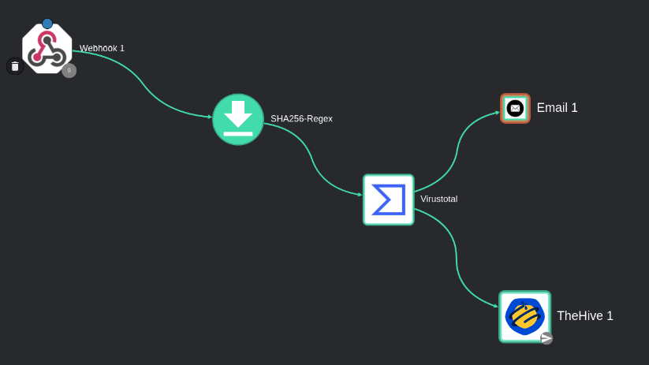
</p>

Configure Email Node:
- **Name**: Send_email_notification
- **Find Actions**: Send email shuffle
- **Recipients**: [email address of SOC analyst]
- **Subject**: Mimikatz Detected!
- **Body**: 
```
Title: $exec.title
Time: $exec.text.win.eventdata.utcTime
Host: $exec.text.win.system.computer
```

<p align="center">
  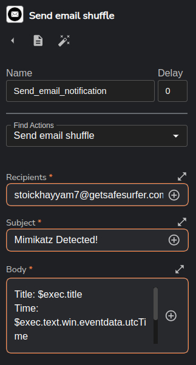
</p>

With this configuration, an email notification will be sent to the designated SOC analyst whenever the workflow detects Mimikatz execution. This allows for immediate awareness and prompt response to potential threats. Now, we save the workflow and re run, then we go to our enail, and we will see the email from **shuffle.io**

<p align="center">
  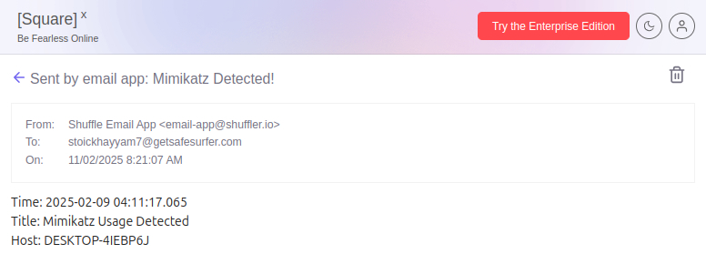
</p>

## 4. Conclusion
This project successfully demonstrates the construction of an automated SOC environment capable of detecting and responding to the execution of Mimikatz. By integrating Wazuh, Sysmon, TheHive, Shuffle, and VirusTotal, we've created a system that can effectively monitor for, analyze, and respond to security events.

This project provides a foundation for building more complex and robust SOC automation workflows. Potential next steps include:
- Expanding detection capabilities: Incorporate additional rules and techniques to detect other malicious activities and attacker tools.
- Enhancing response actions: Automate more sophisticated response actions, such as isolating infected machines or blocking malicious network traffic.
- Integrating with threat intelligence platforms: Leverage threat intelligence to proactively identify and mitigate emerging threats.
- Implementing continuous monitoring and improvement: Regularly review and update the SOC environment to ensure its effectiveness against evolving threats.

By building and experimenting with this homelab project, you've gained valuable hands-on experience with essential security tools and concepts. This knowledge can be applied to real-world SOC environments to improve security posture and incident response capabilities.
